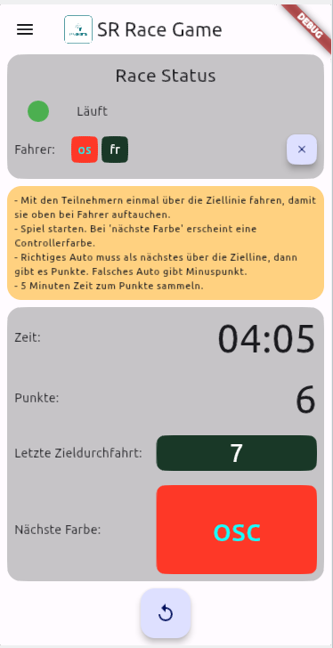

# SR Race Monitor

**Tests:**

Race monitor and little game utilizing the [SmartRace-App](https://smartrace.de) for slotcar racing.

This app receives events from the smartrace app for slotcar racing. See [smartrace.de](https://www.smartrace.de/en/)
and [buy them a coffee](https://www.smartrace.de/en/buy-me-a-coffee/).
The adapter uses the [data interface](https://www.smartrace.de/en/the-smartrace-manual/data-interface/) which is a paid
feature, so if you don't have a slotcar racetrack and don't use the
smartrace app or don't want to pay for the data interface then this app is not for you.

## Changelog

### 1.0.0

- first working version

## Screenshots

## Usage

- Under releases, you find prebuilt packages for Android, Windows, Linux and macOS.
    - Windows: Extract and start executable.
    - Linux: Extract and start executable.
    - Android: Install package for your architecture or try app-release.apk
    - macOS: I don't know. Look into macos-release.zip. Feedback welcome.
    - ioOS. I don't know. I can build an iosApp, but don't know which files are necessary to install. Contact me if you
      can provide any help.
- Start SmartRace-App
    - Enable and configure data interface according to https://www.smartrace.de/en/the-smartrace-manual/data-interface/
    - URL needs to be the url or ip of the device on which this app runs. Port is 8085.
- Start this app.
    - On starting or stopping the control unit the current state should be visible under `Race Status`
    - On driving over the finish line the driver should appear under `Race Status`. You can reset this list with the
      little `x`-Button.
- Playing the game.
    - All driver have to work together to get points.
    - After each driver is recognized. Hit the `Play` button.
    - The game chooses a random driver and shows the controller color. This driver is the next to cross the finish line
      to get points. If a wrong driver crosses the line first you loose a point.
    - The game duration is 5 minutes. Try to get as many points as possible.

## Contribute

This project is a Flutter application.
A few resources to get you started if this is your first Flutter project:

- [Lab: Write your first Flutter app](https://docs.flutter.dev/get-started/codelab)
- [Cookbook: Useful Flutter samples](https://docs.flutter.dev/cookbook)

For help getting started with Flutter development, view the
[online documentation](https://docs.flutter.dev/), which offers tutorials,
samples, guidance on mobile development, and a full API reference.
